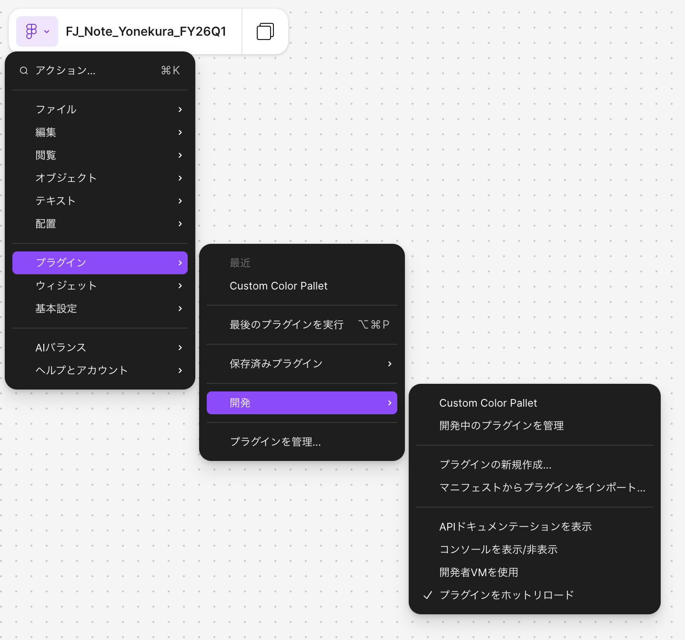

# Custom Color Pallet

Figma / FigJam / Slides 用のカスタムカラーパレットプラグインです。
ZENKIGEN ブランドカラーを初期パレットとして提供し、選択中のオブジェクトにワンクリックで色を適用できます。

## 主な機能

- **ZENKIGEN ブランドカラー** を 3 種類のビルトインパレットで提供
  - ZENKIGEN User（FigJam 向けの柔らかい彩度）
  - ZENKIGEN User Light（淡色バリエーション）
  - ZENKIGEN Primitive（Primitive 代表色）
- **カスタムパレット** の追加・削除（`figma.clientStorage` に保存）
- **カスタムカラー** の追加・削除（HEX 入力 / カラーピッカー対応）
- 選択ノードへのワンクリック適用（Sticky / Shape / Text / Section は塗り、Connector は線）
- **適用対象の切替**（自動 / 塗り / 線）

## 動作環境

- Figma デスクトップアプリ（Mac / Windows）
- Figma / FigJam / Slides で利用可能

> ⚠️ ブラウザ版 Figma では「開発中プラグイン」のインポートができません。必ずデスクトップアプリを使用してください。

## インストール手順（チームメンバー向け）

### 1. リポジトリを取得する

#### 方法 A：Git を使う場合

```bash
git clone <このリポジトリのURL>
```

#### 方法 B：Git を使わない場合

GitHub のリポジトリページ右上 **Code → Download ZIP** から ZIP をダウンロードし、任意のフォルダに解凍します。

### 2. Figma でプラグインをインポートする

1. Figma デスクトップアプリを起動して、任意の Figma / FigJam ファイルを開く
2. 左上の Figma アイコンをクリック → **プラグイン → 開発 → マニフェストからプラグインをインポート...** を選択
   - もしくはキャンバス上で右クリック → **プラグイン → 開発 → マニフェストからプラグインをインポート...**
3. ダウンロードしたフォルダの中の **`manifest.json`** を選択



### 3. プラグインを使う

- 任意の Figma / FigJam ファイルを開く
- 左上の Figma アイコン → **プラグイン → 開発 → Custom Color Pallet** を選択
- パレットから色を選び、選択中のオブジェクトに適用

## 使い方

### 色を適用する

1. 色を変えたいオブジェクト（Sticky / Shape / Connector / Text など）を選択
2. プラグイン UI で適用対象（**自動 / 塗り / 線**）を選ぶ
3. パレット内の色をクリック

### カスタムパレットを追加する

1. UI 上部のパレット選択ドロップダウン横の **`+`** ボタンをクリック
2. パレット名を入力して **作成**

### カスタムカラーを追加する

1. カスタムパレットを選択した状態でグリッド末尾の **`+`** をクリック
2. カラーピッカー / HEX で色を指定し、必要なら名前を入力して **追加**

### カスタムパレット / カラーを削除する

- カスタムパレット：UI 上部の **`×`** ボタン（ビルトインは削除不可）
- カスタムカラー：色見本にカーソルを乗せると右上に表示される **`×`** をクリック

## アップデート方法

新しいバージョンが出たら：

```bash
git pull
```

または ZIP を再ダウンロードして上書きしてください。Figma 側での再インポートは不要です（同じフォルダを参照しているため、`code.js` / `ui.html` の変更が次回起動時に自動反映されます）。

## 開発者向け

ソースを編集してビルドし直す場合：

```bash
npm install
npm run build      # code.ts → code.js
npm run lint       # ESLint チェック
npm run watch      # 変更を監視して自動ビルド
```

### ファイル構成

| ファイル | 役割 |
|---|---|
| `manifest.json` | プラグイン定義（Figma が読み込むエントリ） |
| `code.ts` | プラグインのメインロジック（ソース） |
| `code.js` | `code.ts` のビルド出力（Figma が実行する） |
| `ui.html` | プラグイン UI |
| `icon.png` / `thumbnail.png` | プラグインアイコン / サムネイル |

## トラブルシューティング

- **「色コードが無効です」と表示される** → HEX が `#RRGGBB` 形式（6桁）になっているか確認してください
- **「オブジェクトを選択してください」と表示される** → キャンバス上で対象オブジェクトを選択してから色をクリックしてください
- **メニューにプラグインが出てこない** → デスクトップアプリで開いているか、`manifest.json` のインポートに成功しているか確認してください
